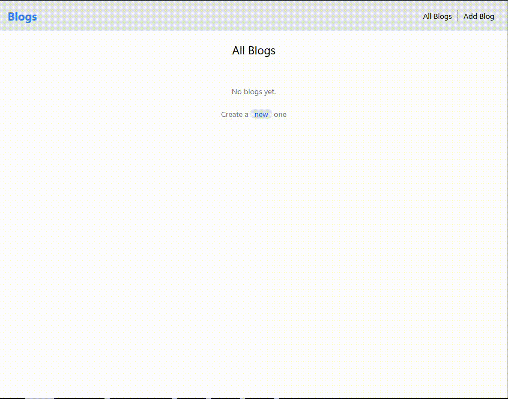

# 📝 MERN Blog App

A simple full-stack blog application built using the MERN stack (MongoDB, Express, React, Node.js). Users can:

- Add a new blog (title, content, and author)
- View all blog posts

This project uses:
- **React + Vite + TailwindCSS** for the frontend
- **Node.js + Express** for the backend (running at `http://localhost:3000`)
- **MongoDB** for storing blog data

## Demo

